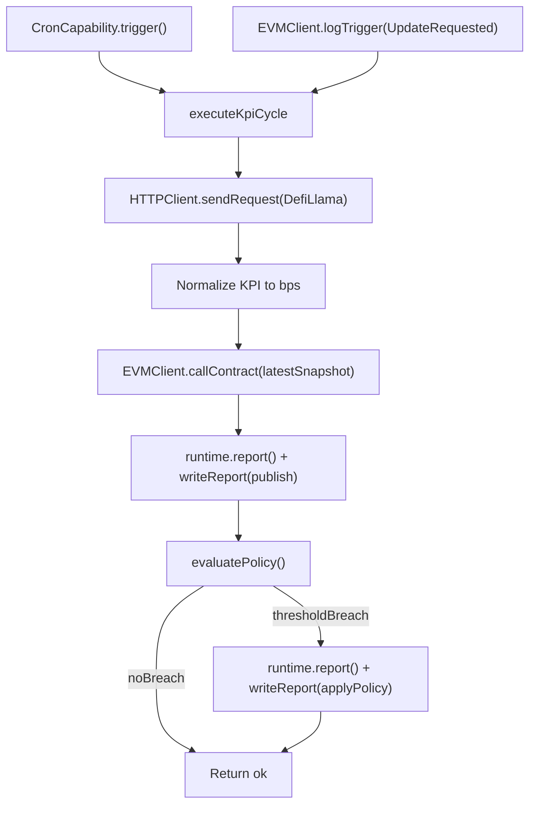

# KPI Pulse Architecture v1

## Components

- `cre-workflow/` CRE SDK-native TypeScript workflow using `@chainlink/cre-sdk` triggers, capabilities, and consensus-backed execution.
  - `main.ts` registers two `cre.handler()` entries: CronCapability trigger + EVMClient.logTrigger.
  - `cronCallback.ts` + `logCallback.ts` delegate to shared `kpiCycle.ts` (`executeKpiCycle`).
  - `kpiCycle.ts` orchestrates: HTTPClient fetch -> EVMClient.callContract read -> runtime.report() + EVMClient.writeReport for publish -> conditional applyPolicy write.
- `workflows/` ethers-based TypeScript execution path for local demo scripts.
- `contracts/KpiOracle.sol` onchain KPI snapshot registry.
- `contracts/PolicyManager.sol` policy config and threshold evaluation helpers.
- `contracts/StrategyController.sol` risk mode state machine and policy application.
- Public KPI endpoint adapter (DefiLlama for MVP).
- Tenderly Virtual TestNet for deployment, tx inspection, and demo evidence.
- Foundry build pipeline (`forge`) with TypeScript deployment scripts.

## Data Flow

## Trust Boundaries

1. External API response -> workflow parsing.
2. Workflow capability calls -> onchain writes.
3. Policy configuration authority -> runtime behavior.

## Failure Modes and Mitigations

- **Endpoint unavailable or rate-limited**
  - Retry with backoff; fail closed with no write if validation fails.
- **Schema drift**
  - Strict parsing and normalized type checks before any chain call.
- **Policy noise / false positives**
  - Include cooldown/hysteresis parameters in policy logic.
- **Write revert**
  - Surface explicit run errors and retain traceability in logs.
- **Reactive trigger spam**
  - Access control or cooldown in update request path.

## Security and Scope Notes

- Current implementation is MVP-oriented and focuses on deterministic demo reliability.
- Full threat model and production hardening is planned for post-MVP iterations.
